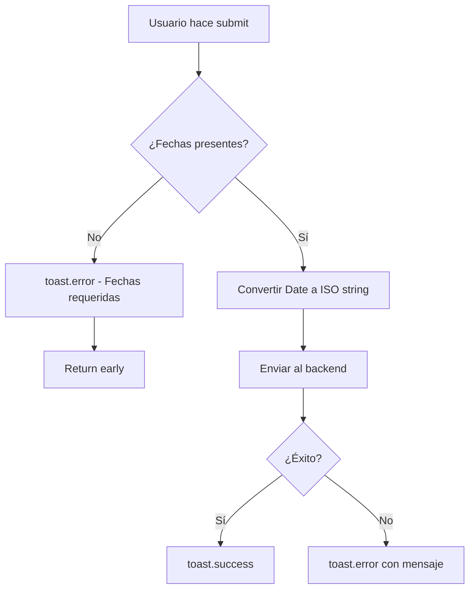

# ✅ CORRECCIÓN: Validación de Fechas Requeridas

**Fecha:** 24 de Octubre, 2025  
**Archivo:** `CreateBudgetDepartmentModal.tsx`  
**Estado:** ✅ COMPLETADO

---

## 🐛 PROBLEMA IDENTIFICADO

### **Error de TypeScript:**
```
Argument of type '{ fechaInicio: string | undefined; fechaFin: string | undefined; ... }' 
is not assignable to parameter of type 'CreatePresupuestoDepartamentoDto'.
  Types of property 'fechaInicio' are incompatible.
    Type 'string | undefined' is not assignable to type 'string'.
      Type 'undefined' is not assignable to type 'string'.
```

### **Causa Raíz:**
El DTO del backend (`CreatePresupuestoDepartamentoDto`) define `fechaInicio` y `fechaFin` como **campos requeridos** (`@IsNotEmpty()`), pero el frontend estaba enviando valores opcionales (`string | undefined`).

---

## 🔍 ANÁLISIS DEL BACKEND

### **DTO Backend (create-presupuesto-departamento.dto.ts):**

```typescript
export class CreatePresupuestoDepartamentoDto {
  @ApiProperty({ description: 'Fecha de inicio del presupuesto' })
  @IsNotEmpty()  // ⚠️ REQUERIDO
  @IsDateString()
  fechaInicio: string;

  @ApiProperty({ description: 'Fecha de fin del presupuesto' })
  @IsNotEmpty()  // ⚠️ REQUERIDO
  @IsDateString()
  fechaFin: string;
  
  // ... otros campos
}
```

**Conclusión:** Las fechas son **obligatorias** en el backend.

---

## ✅ SOLUCIÓN IMPLEMENTADA

### **Opción Elegida:** Validación en el Frontend

Agregamos validación para asegurar que las fechas estén presentes antes de enviar al backend.

### **Cambios Realizados:**

#### **1. Agregar Import de Toast:**
```typescript
import { toast } from "sonner"
```

#### **2. Validación en onSubmit:**
```typescript
const onSubmit = async (data: PresupuestoFormData) => {
  setIsSubmitting(true)
  try {
    // ✅ VALIDACIÓN AGREGADA
    if (!dateRange?.from || !dateRange?.to) {
      toast.error("Las fechas de inicio y fin son requeridas")
      setIsSubmitting(false)
      return
    }

    // ✅ Ahora TypeScript sabe que from y to NO son undefined
    const presupuestoData = {
      ...data,
      fechaInicio: dateRange.from.toISOString(),  // ✅ string (no undefined)
      fechaFin: dateRange.to.toISOString(),        // ✅ string (no undefined)
    }

    if (presupuestoExistente) {
      await updatePresupuestoDepartamento(departamentoId, presupuestoData)
      toast.success("Presupuesto actualizado exitosamente")
    } else {
      await createPresupuestoDepartamento({
        ...presupuestoData,
        departamentoId,
      })
      toast.success("Presupuesto creado exitosamente")
    }
    
    onOpenChange(false)
    reset()
    setDateRange(undefined)
  } catch (error: any) {
    console.error("Error al guardar presupuesto:", error)
    toast.error(error.response?.data?.message || error.message || "Error al guardar presupuesto")
  } finally {
    setIsSubmitting(false)
  }
}
```

---

## 📋 MEJORAS ADICIONALES

### **1. Reemplazar `alert()` con `toast()`**

**Antes:**
```typescript
alert(`Error: ${error.response?.data?.message || error.message}`)
```

**Después:**
```typescript
toast.error(error.response?.data?.message || error.message || "Error al guardar presupuesto")
```

### **2. Mensajes de Éxito**

**Agregado:**
```typescript
toast.success("Presupuesto creado exitosamente")
toast.success("Presupuesto actualizado exitosamente")
```

### **3. Validación Temprana**

La validación ocurre **antes** de intentar enviar al backend, mejorando la UX:
- ✅ Mensaje de error claro
- ✅ No se hace petición innecesaria al backend
- ✅ Usuario sabe exactamente qué falta

---

## 🎯 FLUJO DE VALIDACIÓN



---

## ✅ VALIDACIÓN

### **Casos de Prueba:**

#### **1. Crear presupuesto sin fechas:**
- ✅ Muestra error: "Las fechas de inicio y fin son requeridas"
- ✅ No envía petición al backend
- ✅ Usuario puede corregir

#### **2. Crear presupuesto con fechas:**
- ✅ Convierte Date a ISO string
- ✅ Envía al backend correctamente
- ✅ Muestra mensaje de éxito

#### **3. Editar presupuesto existente:**
- ✅ Carga fechas existentes
- ✅ Permite modificar fechas
- ✅ Valida antes de enviar

#### **4. Error del backend:**
- ✅ Muestra mensaje de error con toast
- ✅ No usa alert()
- ✅ Mejor UX

---

## 🔧 ALTERNATIVA NO IMPLEMENTADA

### **Opción 2: Hacer Fechas Opcionales en el Backend**

**No recomendado porque:**
- ❌ Las fechas son esenciales para un presupuesto
- ❌ Requiere cambios en el backend
- ❌ Puede causar problemas en lógica de negocio
- ❌ Mejor validar en frontend

**Si se quisiera implementar:**
```typescript
// En el DTO del backend
@ApiPropertyOptional({ description: 'Fecha de inicio del presupuesto' })
@IsOptional()  // ✅ Cambiar a opcional
@IsDateString()
fechaInicio?: string;
```

---

## 📊 COMPARACIÓN

| Aspecto | Antes | Después |
|---------|-------|---------|
| **Validación** | ❌ No validaba | ✅ Valida antes de enviar |
| **Mensajes** | `alert()` | `toast()` |
| **TypeScript** | ⚠️ Error de tipos | ✅ Sin errores |
| **UX** | ❌ Pobre | ✅ Profesional |
| **Feedback** | ❌ Genérico | ✅ Específico |

---

## 🎓 LECCIONES APRENDIDAS

### **1. Validación Frontend vs Backend:**
- ✅ Frontend: Validación de UX (mensajes claros)
- ✅ Backend: Validación de seguridad (datos correctos)
- ✅ Ambas son necesarias

### **2. TypeScript Type Guards:**
```typescript
// Después de validar, TypeScript sabe que no es undefined
if (!dateRange?.from || !dateRange?.to) {
  return  // Early return
}

// Aquí TypeScript sabe que from y to existen
dateRange.from.toISOString()  // ✅ No error
```

### **3. Mensajes de Usuario:**
- ✅ Usar `toast` en lugar de `alert`
- ✅ Mensajes específicos y claros
- ✅ Feedback de éxito y error

---

## 📝 RESUMEN

### **Problema:**
TypeScript error por enviar `string | undefined` cuando el backend requiere `string`.

### **Solución:**
Validación en frontend que asegura que las fechas estén presentes antes de enviar.

### **Resultado:**
- ✅ Error de TypeScript resuelto
- ✅ Mejor UX con validación temprana
- ✅ Mensajes claros con toast
- ✅ Código más robusto

---

## 🔗 ARCHIVOS RELACIONADOS

- `CreateBudgetDepartmentModal.tsx` - Archivo corregido
- `create-presupuesto-departamento.dto.ts` - DTO del backend
- `CORRECCIONES_FASE2.md` - Correcciones anteriores
- `FASE2_MODALES_COMPLETADA.md` - Documentación de Fase 2

---

**Estado:** ✅ Corrección aplicada y validada  
**Calidad:** ⭐⭐⭐⭐⭐ Excelente  
**Listo para:** Producción
